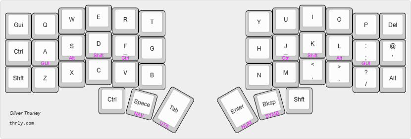
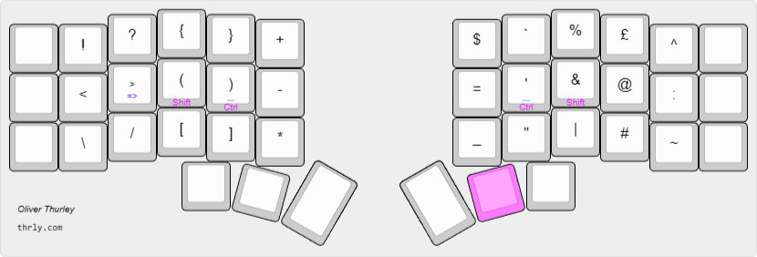

# thrly's ZMK configuration

> This config is for a 6-col corne (wireless version from [Typeractive](https://typeractive.xyz/)), but I'm gradually trying to wittle it down to a smaller custom 36-key 5-col that I'm designing myself...

For more explanations and reflections on this customization, see [my blog post](https://thrly.com/blog/thoughts-on-customising-a-split-keyboard-layout/) on this keymap.

> [!WARNING]
> This is my personal daily driver keyboard config, it is under active development. Expect tweaking and occasional breaking changes. Documentation may be missing or out of sync with the latest commits. Proceed with caution.

## Key Features

- QWERTY alpha layout
- Homerow mods ([balanced flavour](https://zmk.dev/docs/keymaps/behaviors/hold-tap#option-3-balanced)) - `Gui-Alt-Shf-Ctl`
- Sticky shift
- Mouse behavior on Nav layer
- Horizontal Num layer
- Thumb keys transparent on layers (for `Ctrl` and `Shift`)
- Combos:
  - volume up / down (outer right top + middle / middle + bottom)
  - caps word / caps lock (`G`+`J` / `T`+`Y`)
  - escape (`Q`+`W`)
  - delete (`O`+`P`)
- double-tap `>` for `=>` arrow
> [!IMPORTANT]
> Home Row Mods are now standard.

## Layers

### Base layer

### Symbol layer

### Nav layer

### Num layer

## Dependencies

- https://github.com/M165437/nice-view-gem
- ~https://github.com/urob/zmk-helpers~ (temporarily depreciated)
- ~https://github.com/urob/zmk-config~ (temporarily depreciated)

(I was having a few build errors while trying to use urob's elements so I've moved to the ZMK docs' 'balanced' HRM implementation until I fix it, and I've been happy with this.)

## Notes

- Configure keymap with https://nickcoutsos.github.io/keymap-editor/
- Flash firmware from latest 'Actions' artifact
